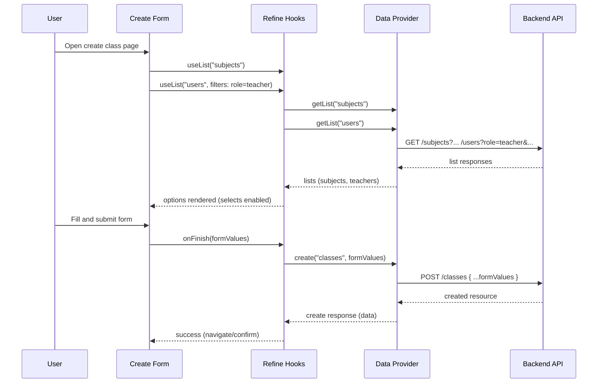

# Admin-Dashboard-Frontend
Frontend for a university admin dashboard. Allows admins, teachers, and students to manage departments, subjects, classes, and enrollments. Built with React, Refine, TypeScript, and Shadcn/ui.

## Tech Stack

| Layer | Technology |
|---|---|
| Framework | React 18 + Vite |
| Language | TypeScript |
| Admin Framework | Refine Core |
| Routing | React Router v6 |
| Styling | Tailwind CSS |
| Components | Shadcn/ui |
| Forms | React Hook Form + Zod |
| Data Table | TanStack Table via Refine |
| Image Upload | Cloudinary Upload Widget |
| Theme | Dark / Light mode support |




## Features

**Subjects**
- List view with server-side pagination
- Search by name or code
- Filter by department
- Create new subject with form validation

**Classes**
- Create class with banner image upload via Cloudinary
- Assign subject and teacher
- Set capacity and status (active / inactive)
- Class scheduling via JSONB field

**Auth (via Backend)**
- Role-based UI — student, teacher, admin see different views
- Session management via Better-Auth

## Data Provider

Custom Refine data provider translates `useTable` filters and pagination into backend query params:

```text
useTable filters → buildQueryParams → GET /api/subjects?search=math&department=CS&page=1&limit=10
```

Handles: pagination, search, department filtering, total count for page controls.

## Getting Started

### Prerequisites
- Node.js 20+
- Backend running (see [Admin-Dashboard-Backend](https://github.com/maherhms/Admin-Dashboard-Backend))
- Cloudinary account

### Installation

```bash
git clone https://github.com/maherhms/Admin-Dashboard-Frontend
cd Admin-Dashboard-Frontend
npm install
```

### Environment Variables

Create a `.env` file:

```env
VITE_BACKEND_URL=http://localhost:3000
VITE_CLOUDINARY_CLOUD_NAME=
VITE_CLOUDINARY_UPLOAD_PRESET=
```

### Run

```bash
# development
npm run dev

# build
npm run build
```

## Backend

→ [Admin-Dashboard-Backend](https://github.com/maherhms/Admin-Dashboard-Backend)

## Release Notes 0.5
### New Features

- View detailed class information including instructor, subject, and department details
- Class pages now display banners with instructor names and optimized image delivery
"Join Class" call-to-action added to class detail pages
## Release Notes 0.4
### New Features

- Integrated analytics tracking to monitor user interactions and behavior, providing detailed insights into application usage patterns and engagement metrics.
- Enhanced routing configuration to improve single-page application navigation experience and ensure seamless request handling across all application routes.
## Release Notes 0.3.2
### New Features

- Class creation form now dynamically loads available subjects and teachers from the backend instead of using static lists.
- Form submissions now integrate with the backend API for creating classes.
## Release Notes 0.2.3
### New Features
- Introduced user roles system (Student, Teacher, Admin)
- Enhanced department data structure and management
- Integrated backend API for dynamic data loading

## Release Notes 0.1.2
### New Features
- Introduced a Dashboard home page
- Added Subjects management section with list view, search functionality, and department filtering
- Added ability to create new subjects
### Updates
- Restructured CSS organization for improved component styling
- Reorganized app navigation and routing structure
---
## License

MIT
